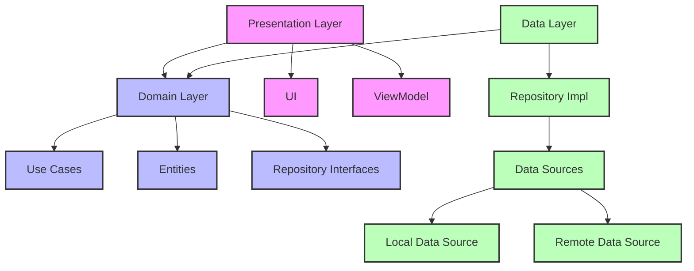

<h1 align="center"> 💱 ARK Rate</h1>

**ARK Rate** is the **open-source Android app** that redefines currency conversion and portfolio management! Convert over **200 currencies** instantly, manage **cryptocurrencies**, and monitor your assets—all in one blazing-fast, ad-free app. Whether you’re traveling offline in Tokyo or trading BTC in New York, ARK Rate delivers offline-first accuracy with zero hassle. Ready to master your money? Let’s dive into the future of finance!

## 📱 Screenshots

## 🌟 Why ARK Rate Rules the Money Game
- **Instant Conversions**: Swap USD to JPY, EUR to NGN, or BTC to ETH in a flash! ⚡
- **200+ Currencies**: From GBP to CZK, we’ve got the world’s money covered. 🌎
- **Crypto Power**: Track and convert BTC, ETH, SOL, and more with live crypto rates.
- **Portfolio Tracking**: Manage fiat and crypto assets. 📊
- **Offline Mode**: Convert currencies anywhere, no Wi-Fi needed! 📴
- **Ad-Free & No Login**: Pure, distraction-free finance—no sign-ups, no nonsense. 🚀

**[Discover ARK Rate](https://www.ark-builders.dev/apps/rate)**

## 🛠 Tech Stack:
Our stack is a love letter to modern development, blending cutting-edge libraries with rock-solid architecture. Here’s the magic behind the scenes! 💻

- **Kotlin 2.0+**: The latest Kotlin powers our code with sleek syntax, bulletproof null safety, and next-gen features. It’s fast, expressive, and keeps ARK Rate future-proof! 🚀
- **Jetpack Compose**: Say hello to a jaw-dropping UI! Compose crafts ARK Rate’s slick, responsive interface for seamless currency swaps and portfolio views. 🎨
- **Compose Destinations**: KSP library that processes annotations and generates code that uses Official Jetpack Compose Navigation under the hood, without boilerplate code 🎯
- **Jetpack Glance**: Home screen widgets? Nailed it! Glance brings instant rate updates to your fingertips, no app launch needed. 📱
- **Dagger**: Precision dependency injection keeps our code modular and testable, injecting everything from databases to network clients like a pro. 🔪
- **MVVM+**: Our Model-View-ViewModel architecture ensures clean, scalable code, powering real-time rate updates with zero fuss. Empowered by [orbit-mvi](https://github.com/orbit-mvi/orbit-mvi), Redux/MVI-like library - but without the baggage. It's so simple we think of it as MVVM+  📊
- **Clean Architecture**: Layered, modular, and maintainable—our codebase is built to scale, making it easy to add epic new features. 🏗️
- **Room Database**: Offline conversions? No sweat! Room stores currency data locally for instant access, even on a remote safari. 💾
- **WorkManager**: Background tasks like rate syncing run smoothly, ensuring your portfolio stays fresh without draining your battery. ⏰

## 📐 ARK Rate Architecture
Below, our Mermaid-powered tree diagram showcases the repository’s structure with vibrant, color-coded nodes and straight-line connections. Ready to explore this financial beast? Fork it and join the revolution! 🚀

## 🤝 Any contribution is welcomed!
**Coders, traders, and finance geeks—unite!** ARK Rate is open-source and craving your brilliance. Here’s how to make your mark:

1. **Fork the Repo**: Grab it at [ARK-Builders/ARK-Rate](https://github.com/ARK-Builders/ARK-Rate).
2. **Hunt Issues**: Find bugs or features in [issues](https://github.com/ARK-Builders/ARK-Rate/issues).
3. **Chat with Us**: Join the party on [Discord](https://discord.com/invite/uRWJyYBr) or [Telegram](https://t.me/ark_builders).

**Hit that ⭐ Star button** if ARK Rate sparks your financial fire! Your support drives us forward!

## 🔧 Building
To build the project, you need to provide a personal access token to download dependencies hosted on GitHub Packages.

### 📦 GitHub Packages Authentication

1. Generate a **fine-grained personal access token**:
   - URL: [Create token](https://github.com/settings/personal-access-tokens/new)
   - Required access: **Public repositories**

2. Add the token to your `local.properties` file at the root of the project: `gpr.token=$your_github_token`

## 🌐 Connect with ARK-Builders

